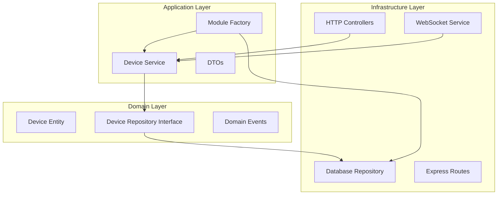
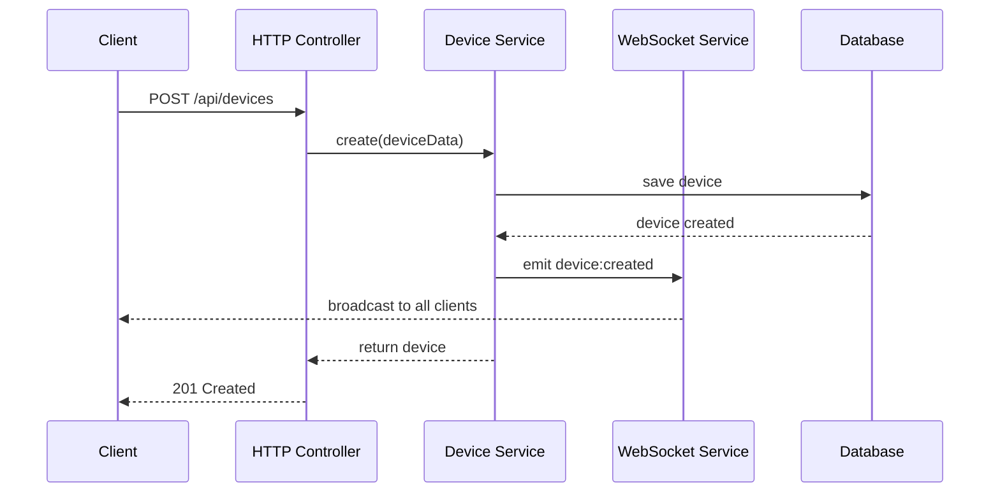

# Design Document

## Overview

O sistema de gerenciamento de dispositivos será implementado seguindo a arquitetura hexagonal existente no projeto. O design inclui um módulo completo para dispositivos com comunicação WebSocket em tempo real, mantendo a separação de responsabilidades e a estrutura de pastas atual.

## Architecture

### Hexagonal Architecture Layers



### WebSocket Integration

O WebSocket será integrado ao servidor Express existente usando Socket.IO, mantendo a arquitetura limpa:



## Components and Interfaces

### Domain Layer

#### Device Entity
```typescript
class Device {
  constructor(
    public readonly id: string,
    public name: string,
    public mac: string,
    public status: DeviceStatus,
    public readonly createdAt: Date
  )

  toggleStatus(): void
  update(data: Partial<DeviceUpdateData>): void
}

enum DeviceStatus {
  ATIVO = 'ATIVO',
  INATIVO = 'INATIVO'
}
```

#### Device Repository Interface
```typescript
interface DeviceRepository {
  create(device: Device): Promise<Device>
  findAll(): Promise<Device[]>
  findById(id: string): Promise<Device | null>
  findByMac(mac: string): Promise<Device | null>
  update(id: string, device: Device): Promise<Device>
  delete(id: string): Promise<void>
}
```

### Application Layer

#### Device Service
```typescript
class DeviceService {
  constructor(
    private deviceRepository: DeviceRepository,
    private websocketService: WebSocketService
  )

  async create(data: CreateDeviceDTO): Promise<Device>
  async findAll(): Promise<Device[]>
  async findById(id: string): Promise<Device>
  async toggleStatus(id: string): Promise<Device>
}
```

#### DTOs
```typescript
interface CreateDeviceDTO {
  name: string
  mac: string
}

interface DeviceResponseDTO {
  id: string
  name: string
  mac: string
  status: DeviceStatus
  createdAt: Date
}
```

### Infrastructure Layer

#### WebSocket Service
```typescript
class WebSocketService {
  private io: Server

  initialize(server: http.Server): void
  emitDeviceCreated(device: Device): void
  emitDeviceStatusChanged(device: Device): void
}
```

#### Device Controller
```typescript
class DeviceController {
  constructor(private deviceService: DeviceService)

  async create(req: Request, res: Response): Promise<void>
  async findAll(req: Request, res: Response): Promise<void>
  async toggleStatus(req: Request, res: Response): Promise<void>
}
```

## Data Models

### Database Schema (Prisma)

```prisma
model Device {
  id        String      @id @default(uuid())
  name      String
  mac       String      @unique
  status    DeviceStatus @default(ATIVO)
  createdAt DateTime    @default(now())
  updatedAt DateTime    @updatedAt

  @@map("devices")
}

enum DeviceStatus {
  ATIVO
  INATIVO
}
```

### API Endpoints

#### POST /api/devices
- **Request Body**: `CreateDeviceDTO`
- **Response**: `DeviceResponseDTO`
- **Status Codes**: 201 (Created), 400 (Bad Request), 409 (Conflict)

#### GET /api/devices
- **Response**: `DeviceResponseDTO[]`
- **Status Codes**: 200 (OK)

#### PATCH /api/devices/:id/status
- **Response**: `DeviceResponseDTO`
- **Status Codes**: 200 (OK), 404 (Not Found)

### WebSocket Events

#### device:created
```typescript
{
  event: 'device:created',
  data: DeviceResponseDTO
}
```

#### device:status
```typescript
{
  event: 'device:status',
  data: DeviceResponseDTO
}
```

## Error Handling

### Validation Errors
- Nome obrigatório: 400 Bad Request
- MAC obrigatório: 400 Bad Request
- MAC duplicado: 409 Conflict

### Business Logic Errors
- Dispositivo não encontrado: 404 Not Found
- Erro interno do servidor: 500 Internal Server Error

### WebSocket Error Handling
- Conexões perdidas são tratadas automaticamente pelo Socket.IO
- Eventos falhos são logados mas não interrompem o fluxo da aplicação
- Reconexão automática do cliente

## Testing Strategy

### Integration Tests
- **POST /api/devices**: Teste de criação com dados válidos e inválidos
- **GET /api/devices**: Teste de listagem com e sem dispositivos
- **PATCH /api/devices/:id/status**: Teste de alteração de status
- **WebSocket Events**: Teste de emissão de eventos em tempo real

### Unit Tests
- **Device Entity**: Teste de métodos de domínio (toggleStatus, update)
- **Device Service**: Teste de lógica de negócio e validações
- **Validation Schemas**: Teste de validação de entrada

### Test Structure
```
tests/
├── integration/
│   ├── device.routes.test.ts
│   └── websocket.test.ts
└── unit/
    ├── device.entity.test.ts
    ├── device.service.test.ts
    └── device.validation.test.ts
```

### Test Database
- Usar banco de teste separado configurado no `.env.test`
- Limpar dados entre testes para garantir isolamento
- Usar transações para rollback automático quando possível

## Implementation Notes

### Module Structure
O módulo seguirá a estrutura existente:
```
src/app/modules/device/
├── domain/
│   ├── Device.ts
│   ├── DeviceRepository.ts
│   └── index.ts
├── dtos/
│   ├── CreateDeviceDTO.ts
│   ├── DeviceResponseDTO.ts
│   └── index.ts
├── factories/
│   ├── makeDeviceModule.ts
│   └── index.ts
├── DeviceService.ts
└── index.ts
```

### WebSocket Integration
- Socket.IO será integrado ao servidor Express existente
- O serviço WebSocket será injetado no DeviceService via factory
- Eventos serão emitidos após operações bem-sucedidas no banco

### Database Migration
- Nova migration será criada para a tabela devices
- Enum DeviceStatus será adicionado ao schema Prisma
- Índice único será criado para o campo mac
