# Design Document - Deploy Docker em Produção

## Overview

Este documento detalha o design para deploy em produção do Sistema de Reservas de Almoço Corporativo usando exclusivamente Docker. O sistema será containerizado com foco em portabilidade, segurança, performance e facilidade de gerenciamento. A arquitetura utiliza containers Docker orquestrados via Docker Compose, com volumes persistentes, rede isolada e monitoramento integrado.

## Architecture

### Arquitetura Docker Completa

```mermaid
graph TB
    subgraph "Rede Externa"
        Users[Funcionários da Empresa] --> Router[Roteador/Firewall]
    end

    subgraph "Servidor Ubuntu Docker Host"
        Router --> Nginx[nginx-proxy:80,443]

        subgraph "Docker Network: bookmenu-network"
            Nginx --> Frontend[bookmenu-frontend:3000]
            Nginx --> Backend[bookmenu-backend:8080]
            Backend --> Database[postgres:5432]

            subgraph "Monitoring Stack"
                Prometheus[prometheus:9090]
                Grafana[grafana:3001]
                Prometheus --> Backend
                Prometheus --> Database
                Prometheus --> Frontend
            end

            subgraph "Management"
                Portainer[portainer:9000]
            end
        end

        subgraph "Docker Volumes"
            DBData[postgres-data]
            AppLogs[app-logs]
            NginxSSL[nginx-ssl]
            Backups[backup-storage]
            GrafanaData[grafana-data]
            PrometheusData[prometheus-data]
        end

        Database --> DBData
        Frontend --> AppLogs
        Backend --> AppLogs
        Nginx --> NginxSSL
        Database --> Backups
        Grafana --> GrafanaData
        Prometheus --> PrometheusData
    end
```



### Arquitetura de Containers


## Components and Interfaces

### 1. Dockerfiles Otimizados

#### 1.1 Backend Dockerfile (Multi-stage)

```dockerfile
# Build stage
FROM node:22-alpine AS builder

WORKDIR /app

# Copy package files
COPY package*.json ./
COPY prisma ./prisma/

# Install dependencies
RUN npm ci --only=production && npm cache clean --force

# Copy source code
COPY . .

# Generate Prisma client
RUN npx prisma generate

# Build application
RUN npm run build

# Production stage
FROM node:22-alpine AS production

# Create non-root user
RUN addgroup -g 1001 -S nodejs
RUN adduser -S bookmenu -u 1001

WORKDIR /app

# Copy built application
COPY --from=builder --chown=bookmenu:nodejs /app/dist ./dist
COPY --from=builder --chown=bookmenu:nodejs /app/node_modules ./node_modules
COPY --from=builder --chown=bookmenu:nodejs /app/prisma ./prisma
COPY --from=builder --chown=bookmenu:nodejs /app/package*.json ./

# Install security updates
RUN apk update && apk upgrade && apk add --no-cache dumb-init

# Switch to non-root user
USER bookmenu

# Expose port
EXPOSE 8080

# Health check
HEALTHCHECK --interval=30s --timeout=10s --start-period=5s --retries=3 \
  CMD node -e "require('http').get('http://localhost:8080/health', (res) => { process.exit(res.statusCode === 200 ? 0 : 1) })"

# Start application
ENTRYPOINT ["dumb-init", "--"]
CMD ["node", "dist/server.js"]
```

#### 1.2 Frontend Dockerfile (Multi-stage)

```dockerfile
# Dependencies stage
FROM node:22-alpine AS deps
RUN apk add --no-cache libc6-compat
WORKDIR /app
COPY package*.json ./
RUN npm ci --only=production && npm cache clean --force

# Builder stage
FROM node:22-alpine AS builder
WORKDIR /app
COPY --from=deps /app/node_modules ./node_modules
COPY . .

# Build application
ENV NEXT_TELEMETRY_DISABLED 1
RUN npm run build

# Production stage
FROM node:22-alpine AS runner
WORKDIR /app

ENV NODE_ENV production
ENV NEXT_TELEMETRY_DISABLED 1

# Create non-root user
RUN addgroup --system --gid 1001 nodejs
RUN adduser --system --uid 1001 nextjs

# Copy built application
COPY --from=builder /app/public ./public
COPY --from=builder --chown=nextjs:nodejs /app/.next/standalone ./
COPY --from=builder --chown=nextjs:nodejs /app/.next/static ./.next/static

# Install security updates
RUN apk update && apk upgrade && apk add --no-cache dumb-init

USER nextjs

EXPOSE 3000

ENV PORT 3000
ENV HOSTNAME "0.0.0.0"

# Health check
HEALTHCHECK --interval=30s --timeout=10s --start-period=5s --retries=3 \
  CMD node -e "require('http').get('http://localhost:3000', (res) => { process.exit(res.statusCode === 200 ? 0 : 1) })"

ENTRYPOINT ["dumb-init", "--"]
CMD ["node", "server.js"]
```

### 2. Docker Compose Configuration

#### 2.1 docker-compose.yml (Base)

```yaml
version: "3.8"

services:
  postgres:
    image: postgres:17-alpine
    container_name: bookmenu-db
    restart: unless-stopped
    environment:
      POSTGRES_DB: ${DB_NAME:-bookmenu}
      POSTGRES_USER: ${DB_USER:-bookmenu_user}
      POSTGRES_PASSWORD: ${DB_PASSWORD}
      POSTGRES_INITDB_ARGS: "--encoding=UTF-8 --lc-collate=C --lc-ctype=C"
    volumes:
      - postgres_data:/var/lib/postgresql/data
      - ./scripts/init-db.sh:/docker-entrypoint-initdb.d/init-db.sh:ro
      - backup_storage:/backups
    ports:
      - "${DB_PORT:-5432}:5432"
    networks:
      - bookmenu-network
    healthcheck:
      test:
        [
          "CMD-SHELL",
          "pg_isready -U ${DB_USER:-bookmenu_user} -d ${DB_NAME:-bookmenu}",
        ]
      interval: 10s
      timeout: 5s
      retries: 5
      start_period: 30s
    deploy:
      resources:
        limits:
          memory: 1G
          cpus: "1.0"
        reservations:
          memory: 512M
          cpus: "0.5"

  backend:
    build:
      context: ./backend
      dockerfile: Dockerfile
      target: production
    image: bookmenu/backend:${VERSION:-latest}
    container_name: bookmenu-api
    restart: unless-stopped
    environment:
      NODE_ENV: production
      DATABASE_URL: postgresql://${DB_USER:-bookmenu_user}:${DB_PASSWORD}@postgres:5432/${DB_NAME:-bookmenu}
      JWT_SECRET: ${JWT_SECRET}
      JWT_EXPIRES_IN: ${JWT_EXPIRES_IN:-24h}
      PORT: 8080
      LOG_LEVEL: ${LOG_LEVEL:-info}
      FRONTEND_URL: ${FRONTEND_URL:-https://bookmenu.empresa.local}
    volumes:
      - app_logs:/app/logs
      - backup_storage:/backups
    ports:
      - "8080:8080"
    networks:
      - bookmenu-network
    depends_on:
      postgres:
        condition: service_healthy
    healthcheck:
      test:
        [
          "CMD",
          "node",
          "-e",
          "require('http').get('http://localhost:8080/health', (res) => { process.exit(res.statusCode === 200 ? 0 : 1) })",
        ]
      interval: 30s
      timeout: 10s
      retries: 3
      start_period: 40s
    deploy:
      resources:
        limits:
          memory: 1G
          cpus: "1.0"
        reservations:
          memory: 256M
          cpus: "0.25"

  frontend:
    build:
      context: ./frontend
      dockerfile: Dockerfile
      target: runner
    image: bookmenu/frontend:${VERSION:-latest}
    container_name: bookmenu-web
    restart: unless-stopped
    environment:
      NODE_ENV: production
      NEXT_PUBLIC_API_URL: ${NEXT_PUBLIC_API_URL:-https://bookmenu.empresa.local/api}
      PORT: 3000
      HOSTNAME: "0.0.0.0"
    ports:
      - "3000:3000"
    networks:
      - bookmenu-network
    depends_on:
      backend:
        condition: service_healthy
    healthcheck:
      test:
        [
          "CMD",
          "node",
          "-e",
          "require('http').get('http://localhost:3000', (res) => { process.exit(res.statusCode === 200 ? 0 : 1) })",
        ]
      interval: 30s
      timeout: 10s
      retries: 3
      start_period: 30s
    deploy:
      resources:
        limits:
          memory: 512M
          cpus: "0.5"
        reservations:
          memory: 128M
          cpus: "0.1"

  nginx:
    image: nginx:alpine
    container_name: bookmenu-proxy
    restart: unless-stopped
    ports:
      - "80:80"
      - "443:443"
    volumes:
      - ./nginx/nginx.conf:/etc/nginx/nginx.conf:ro
      - ./nginx/conf.d:/etc/nginx/conf.d:ro
      - nginx_ssl:/etc/nginx/ssl:ro
      - app_logs:/var/log/nginx
    networks:
      - bookmenu-network
    depends_on:
      - frontend
      - backend
    healthcheck:
      test: ["CMD", "nginx", "-t"]
      interval: 30s
      timeout: 10s
      retries: 3
    deploy:
      resources:
        limits:
          memory: 256M
          cpus: "0.5"
        reservations:
          memory: 64M
          cpus: "0.1"

volumes:
  postgres_data:
    driver: local
    driver_opts:
      type: none
      o: bind
      device: /opt/bookmenu-docker/volumes/postgres-data
  app_logs:
    driver: local
    driver_opts:
      type: none
      o: bind
      device: /opt/bookmenu-docker/volumes/app-logs
  nginx_ssl:
    driver: local
    driver_opts:
      type: none
      o: bind
      device: /opt/bookmenu-docker/volumes/nginx-ssl
  backup_storage:
    driver: local
    driver_opts:
      type: none
      o: bind
      device: /opt/bookmenu-docker/volumes/backups

networks:
  bookmenu-network:
    driver: bridge
    ipam:
      config:
        - subnet: 172.20.0.0/16
```

#### 2.2 docker-compose.prod.yml (Production Override)

```yaml
version: "3.8"

services:
  postgres:
    deploy:
      replicas: 1
      restart_policy:
        condition: on-failure
        delay: 5s
        max_attempts: 3
        window: 120s
    logging:
      driver: "json-file"
      options:
        max-size: "10m"
        max-file: "3"

  backend:
    deploy:
      replicas: 2
      restart_policy:
        condition: on-failure
        delay: 5s
        max_attempts: 3
        window: 120s
    logging:
      driver: "json-file"
      options:
        max-size: "10m"
        max-file: "3"

  frontend:
    deploy:
      replicas: 2
      restart_policy:
        condition: on-failure
        delay: 5s
        max_attempts: 3
        window: 120s
    logging:
      driver: "json-file"
      options:
        max-size: "10m"
        max-file: "3"

  nginx:
    deploy:
      replicas: 1
      restart_policy:
        condition: on-failure
        delay: 5s
        max_attempts: 3
        window: 120s
    logging:
      driver: "json-file"
      options:
        max-size: "10m"
        max-file: "3"

  prometheus:
    image: prom/prometheus:latest
    container_name: bookmenu-prometheus
    restart: unless-stopped
    ports:
      - "9090:9090"
    volumes:
      - ./monitoring/prometheus.yml:/etc/prometheus/prometheus.yml:ro
      - prometheus_data:/prometheus
    networks:
      - bookmenu-network
    command:
      - "--config.file=/etc/prometheus/prometheus.yml"
      - "--storage.tsdb.path=/prometheus"
      - "--web.console.libraries=/etc/prometheus/console_libraries"
      - "--web.console.templates=/etc/prometheus/consoles"
      - "--storage.tsdb.retention.time=200h"
      - "--web.enable-lifecycle"

  grafana:
    image: grafana/grafana:latest
    container_name: bookmenu-grafana
    restart: unless-stopped
    ports:
      - "3001:3000"
    environment:
      GF_SECURITY_ADMIN_PASSWORD: ${GRAFANA_PASSWORD}
      GF_USERS_ALLOW_SIGN_UP: false
    volumes:
      - grafana_data:/var/lib/grafana
      - ./monitoring/grafana/dashboards:/etc/grafana/provisioning/dashboards:ro
      - ./monitoring/grafana/datasources:/etc/grafana/provisioning/datasources:ro
    networks:
      - bookmenu-network
    depends_on:
      - prometheus

  portainer:
    image: portainer/portainer-ce:latest
    container_name: bookmenu-portainer
    restart: unless-stopped
    ports:
      - "9000:9000"
    volumes:
      - /var/run/docker.sock:/var/run/docker.sock
      - portainer_data:/data
    networks:
      - bookmenu-network

volumes:
  prometheus_data:
    driver: local
  grafana_data:
    driver: local
  portainer_data:
    driver: local
```

### 3. Configurações de Rede e Segurança

#### 3.1 Nginx Configuration para Docker

```nginx
upstream backend {
    least_conn;
    server bookmenu-api:8080 max_fails=3 fail_timeout=30s;
}

upstream frontend {
    least_conn;
    server bookmenu-web:3000 max_fails=3 fail_timeout=30s;
}

# Rate limiting
limit_req_zone $binary_remote_addr zone=api:10m rate=10r/s;
limit_req_zone $binary_remote_addr zone=web:10m rate=30r/s;

server {
    listen 80;
    server_name bookmenu.empresa.local;
    return 301 https://$server_name$request_uri;
}

server {
    listen 443 ssl http2;
    server_name bookmenu.empresa.local;

    # SSL Configuration
    ssl_certificate /etc/nginx/ssl/cert.pem;
    ssl_certificate_key /etc/nginx/ssl/key.pem;
    ssl_protocols TLSv1.2 TLSv1.3;
    ssl_ciphers ECDHE-RSA-AES256-GCM-SHA512:DHE-RSA-AES256-GCM-SHA512:ECDHE-RSA-AES256-GCM-SHA384;
    ssl_prefer_server_ciphers off;

    # Security Headers
    add_header X-Frame-Options DENY always;
    add_header X-Content-Type-Options nosniff always;
    add_header X-XSS-Protection "1; mode=block" always;
    add_header Strict-Transport-Security "max-age=31536000; includeSubDomains" always;
    add_header Referrer-Policy "strict-origin-when-cross-origin" always;

    # API Routes with rate limiting
    location /api/ {
        limit_req zone=api burst=20 nodelay;

        proxy_pass http://backend;
        proxy_http_version 1.1;
        proxy_set_header Upgrade $http_upgrade;
        proxy_set_header Connection 'upgrade';
        proxy_set_header Host $host;
        proxy_set_header X-Real-IP $remote_addr;
        proxy_set_header X-Forwarded-For $proxy_add_x_forwarded_for;
        proxy_set_header X-Forwarded-Proto $scheme;
        proxy_cache_bypass $http_upgrade;

        # Timeouts
        proxy_connect_timeout 60s;
        proxy_send_timeout 60s;
        proxy_read_timeout 60s;
    }

    # Frontend Routes with rate limiting
    location / {
        limit_req zone=web burst=50 nodelay;

        proxy_pass http://frontend;
        proxy_http_version 1.1;
        proxy_set_header Upgrade $http_upgrade;
        proxy_set_header Connection 'upgrade';
        proxy_set_header Host $host;
        proxy_cache_bypass $http_upgrade;
    }

    # Static Assets Caching
    location /_next/static/ {
        proxy_pass http://frontend;
        expires 1y;
        add_header Cache-Control "public, immutable";
    }

    # Health check endpoint
    location /health {
        access_log off;
        return 200 "healthy\n";
        add_header Content-Type text/plain;
    }

    # Compression
    gzip on;
    gzip_vary on;
    gzip_min_length 1024;
    gzip_types
        text/plain
        text/css
        text/xml
        text/javascript
        application/javascript
        application/xml+rss
        application/json;
}
```

### 4. Scripts de Automação Docker

#### 4.1 Deploy Script

```bash
#!/bin/bash
# deploy-docker.sh - Script de deploy automatizado

set -euo pipefail

# Configurações
COMPOSE_FILE="docker-compose.yml"
COMPOSE_PROD_FILE="docker-compose.prod.yml"
ENV_FILE=".env.production"
BACKUP_DIR="/opt/bookmenu-docker/backups"

# Cores para output
RED='\033[0;31m'
GREEN='\033[0;32m'
YELLOW='\033[1;33m'
NC='\033[0m' # No Color

# Funções de log
log_info() {
    echo -e "${GREEN}[INFO]${NC} $1"
}

log_warn() {
    echo -e "${YELLOW}[WARN]${NC} $1"
}

log_error() {
    echo -e "${RED}[ERROR]${NC} $1"
}

# Verificar pré-requisitos
check_prerequisites() {
    log_info "Verificando pré-requisitos..."

    if ! command -v docker &> /dev/null; then
        log_error "Docker não está instalado"
        exit 1
    fi

    if ! command -v docker-compose &> /dev/null; then
        log_error "Docker Compose não está instalado"
        exit 1
    fi

    if [ ! -f "$ENV_FILE" ]; then
        log_error "Arquivo $ENV_FILE não encontrado"
        exit 1
    fi

    log_info "Pré-requisitos OK"
}

# Fazer backup antes do deploy
backup_before_deploy() {
    log_info "Criando backup antes do deploy..."

    BACKUP_NAME="backup-$(date +%Y%m%d-%H%M%S)"
    mkdir -p "$BACKUP_DIR/$BACKUP_NAME"

    # Backup do banco de dados
    if docker ps | grep -q bookmenu-db; then
        docker exec bookmenu-db pg_dump -U bookmenu_user bookmenu > "$BACKUP_DIR/$BACKUP_NAME/database.sql"
        log_info "Backup do banco criado"
    fi

    # Backup das configurações
    cp -r . "$BACKUP_DIR/$BACKUP_NAME/config"
    log_info "Backup das configurações criado"
}

# Build das imagens
build_images() {
    log_info "Construindo imagens Docker..."

    docker-compose -f "$COMPOSE_FILE" -f "$COMPOSE_PROD_FILE" --env-file "$ENV_FILE" build --no-cache

    log_info "Imagens construídas com sucesso"
}

# Deploy dos containers
deploy_containers() {
    log_info "Fazendo deploy dos containers..."

    # Parar containers existentes
    docker-compose -f "$COMPOSE_FILE" -f "$COMPOSE_PROD_FILE" --env-file "$ENV_FILE" down

    # Iniciar novos containers
    docker-compose -f "$COMPOSE_FILE" -f "$COMPOSE_PROD_FILE" --env-file "$ENV_FILE" up -d

    log_info "Containers deployados"
}

# Verificar saúde dos serviços
check_health() {
    log_info "Verificando saúde dos serviços..."

    # Aguardar containers ficarem saudáveis
    local max_attempts=30
    local attempt=1

    while [ $attempt -le $max_attempts ]; do
        if docker-compose -f "$COMPOSE_FILE" -f "$COMPOSE_PROD_FILE" --env-file "$ENV_FILE" ps | grep -q "healthy"; then
            log_info "Serviços estão saudáveis"
            return 0
        fi

        log_warn "Aguardando serviços ficarem saudáveis... (tentativa $attempt/$max_attempts)"
        sleep 10
        ((attempt++))
    done

    log_error "Serviços não ficaram saudáveis no tempo esperado"
    return 1
}

# Executar migrações do banco
run_migrations() {
    log_info "Executando migrações do banco..."

    docker exec bookmenu-api npx prisma migrate deploy

    log_info "Migrações executadas"
}

# Limpeza de imagens antigas
cleanup_old_images() {
    log_info "Limpando imagens antigas..."

    docker image prune -f
    docker system prune -f

    log_info "Limpeza concluída"
}

# Função principal
main() {
    log_info "Iniciando deploy do BookMenu..."

    check_prerequisites
    backup_before_deploy
    build_images
    deploy_containers

    if check_health; then
        run_migrations
        cleanup_old_images
        log_info "Deploy concluído com sucesso!"
    else
        log_error "Deploy falhou - verificar logs dos containers"
        exit 1
    fi
}

# Executar função principal
main "$@"
```

## Data Models

### 1. Environment Variables

```bash
# .env.production
# Database
DB_NAME=bookmenu
DB_USER=bookmenu_user
DB_PASSWORD=super_secure_password_here
DB_PORT=5432

# Application
JWT_SECRET=your_super_secure_jwt_secret_here
JWT_EXPIRES_IN=24h
LOG_LEVEL=info
VERSION=1.0.0

# URLs
FRONTEND_URL=https://bookmenu.empresa.local
NEXT_PUBLIC_API_URL=https://bookmenu.empresa.local/api

# Monitoring
GRAFANA_PASSWORD=admin_password_here

# Docker
COMPOSE_PROJECT_NAME=bookmenu
DOCKER_BUILDKIT=1
```

### 2. Docker Secrets (Alternativa Segura)

```yaml
# docker-compose.secrets.yml
version: "3.8"

secrets:
  db_password:
    file: ./secrets/db_password.txt
  jwt_secret:
    file: ./secrets/jwt_secret.txt
  grafana_password:
    file: ./secrets/grafana_password.txt

services:
  postgres:
    secrets:
      - db_password
    environment:
      POSTGRES_PASSWORD_FILE: /run/secrets/db_password

  backend:
    secrets:
      - db_password
      - jwt_secret
    environment:
      DATABASE_PASSWORD_FILE: /run/secrets/db_password
      JWT_SECRET_FILE: /run/secrets/jwt_secret
```

## Correctness Properties

_A property is a characteristic or behavior that should hold true across all valid executions of a system-essentially, a formal statement about what the system should do. Properties serve as the bridge between human-readable specifications and machine-verifiable correctness guarantees._

### Property 1: Container Health Check Reliability

_For any_ Docker container with health check configured, the container should be marked as unhealthy when the application inside fails, and should be automatically restarted by Docker.
**Validates: Requirements 8.2**

### Property 2: Multi-stage Build Optimization

_For any_ Dockerfile using multi-stage builds, the final production image should contain only necessary runtime dependencies and should be significantly smaller than a single-stage build.
**Validates: Requirements 2.1, 2.3**

### Property 3: Non-root User Security

_For any_ production container, the application should run as a non-root user with minimal privileges, and should not have write access to system directories.
**Validates: Requirements 2.4, 10.1**

### Property 4: Docker Network Isolation

_For any_ container in the Docker network, it should only be able to communicate with explicitly allowed containers and should be isolated from the host network by default.
**Validates: Requirements 4.1, 4.2**

### Property 5: Volume Data Persistence

_For any_ Docker volume containing critical data, the data should persist across container restarts, updates, and host reboots without corruption.
**Validates: Requirements 5.1, 5.5**

### Property 6: Container Resource Limits

_For any_ container with resource limits defined, the container should not exceed the specified CPU and memory limits under normal operation.
**Validates: Requirements 18.1**

### Property 7: Service Discovery and Communication

_For any_ service defined in Docker Compose, it should be discoverable by other services using its service name and should establish connections successfully.
**Validates: Requirements 4.4**

### Property 8: Health Check Dependency Management

_For any_ service with dependencies defined in Docker Compose, the service should only start after its dependencies are healthy and ready.
**Validates: Requirements 3.2**

### Property 9: SSL Certificate Sharing

_For any_ SSL certificate stored in a Docker volume, it should be accessible by the proxy container and should enable HTTPS connections successfully.
**Validates: Requirements 5.4, 7.2**

### Property 10: Database Connection Pooling

_For any_ database container, it should handle multiple concurrent connections from application containers without connection failures under normal load.
**Validates: Requirements 6.5**

### Property 11: Log Aggregation

_For any_ container generating logs, the logs should be collected in a centralized location and should be accessible for monitoring and debugging.
**Validates: Requirements 8.1**

### Property 12: Container Restart Policy

_For any_ container with restart policy configured, it should automatically restart when it fails and should respect the maximum retry limits.
**Validates: Requirements 3.2**

### Property 13: Image Security Scanning

_For any_ Docker image built for production, it should pass security vulnerability scans and should not contain known high-severity vulnerabilities.
**Validates: Requirements 10.4**

### Property 14: Backup Volume Accessibility

_For any_ backup volume, it should be accessible by backup scripts and should allow successful backup and restore operations.
**Validates: Requirements 9.1, 9.4**

### Property 15: Rolling Update Zero Downtime

_For any_ service update using rolling deployment, the service should remain available to users throughout the update process.
**Validates: Requirements 11.2**

### Property 16: Container Registry Authentication

_For any_ private Docker registry, containers should authenticate successfully and pull images without exposing credentials in logs.
**Validates: Requirements 1.5**

### Property 17: Monitoring Metrics Collection

_For any_ container being monitored, metrics should be collected continuously and should be available in the monitoring dashboard.
**Validates: Requirements 8.1**

### Property 18: Network Policy Enforcement

_For any_ network policy defined, containers should only communicate through allowed ports and protocols as specified in the policy.
**Validates: Requirements 4.3**

### Property 19: Secret Management Security

_For any_ Docker secret, it should be accessible only to authorized containers and should not be visible in container environment variables or logs.
**Validates: Requirements 10.2**

### Property 20: Container Startup Order

_For any_ multi-container application, containers should start in the correct dependency order and should wait for dependencies to be ready.
**Validates: Requirements 3.1**

## Error Handling

### 1. Container Failure Scenarios

#### 1.1 Container Crash Recovery

- **Automatic Restart**: Docker restart policies ensure failed containers restart automatically
- **Health Check Failures**: Containers failing health checks are marked unhealthy and restarted
- **Resource Exhaustion**: Containers exceeding resource limits are killed and restarted
- **Dependency Failures**: Dependent containers wait for dependencies to become healthy

#### 1.2 Image and Build Failures

- **Build Failures**: Multi-stage builds fail fast with clear error messages
- **Image Pull Failures**: Fallback to local builds if registry is unavailable
- **Layer Cache Issues**: Build with --no-cache flag when cache is corrupted
- **Registry Authentication**: Retry with exponential backoff for registry connection issues

### 2. Network and Communication Errors

#### 2.1 Service Discovery Issues

- **DNS Resolution**: Docker's internal DNS resolves service names automatically
- **Network Partitions**: Health checks detect network issues and restart containers
- **Port Conflicts**: Docker Compose validates port assignments before starting
- **Load Balancer Failures**: Nginx upstream configuration handles backend failures

#### 2.2 Volume and Storage Errors

- **Volume Mount Failures**: Docker validates volume mounts before container start
- **Disk Space Issues**: Monitoring alerts when disk usage exceeds thresholds
- **Permission Issues**: Containers run as non-root users with proper volume permissions
- **Data Corruption**: Regular backups and integrity checks prevent data loss

### 3. Security and Access Control

#### 3.1 Authentication and Authorization

- **Secret Exposure**: Docker secrets prevent sensitive data from appearing in logs
- **Container Escape**: Non-root users and security contexts prevent privilege escalation
- **Network Isolation**: Docker networks isolate containers from host and external networks
- **Image Vulnerabilities**: Regular security scans identify and patch vulnerabilities

### 4. Monitoring and Alerting

#### 4.1 Proactive Error Detection

- **Health Monitoring**: Continuous health checks detect issues before they impact users
- **Resource Monitoring**: Prometheus alerts when containers approach resource limits
- **Log Monitoring**: Centralized logging captures and analyzes error patterns
- **Performance Monitoring**: Grafana dashboards show performance trends and anomalies

## Testing Strategy

### 1. Container Testing

#### 1.1 Unit Tests for Containers

- **Dockerfile Linting**: Use hadolint to validate Dockerfile best practices
- **Image Security Testing**: Scan images with tools like Trivy or Clair
- **Container Structure Tests**: Validate container structure and configuration
- **Health Check Testing**: Verify health check endpoints respond correctly

#### 1.2 Integration Tests

- **Service Communication**: Test communication between containers
- **Database Connectivity**: Verify backend can connect to database container
- **Volume Persistence**: Test data persistence across container restarts
- **Network Isolation**: Verify containers can only access allowed services

### 2. Property-Based Testing for Docker

#### 2.1 Infrastructure Properties

Each property will be tested with automated scripts that generate various scenarios and validate the expected behavior holds true across all cases.

**Testing Framework**: Custom bash scripts with Docker commands
**Test Execution**: Minimum 100 iterations per property
**Test Environment**: Isolated Docker networks and volumes for each test run

#### 2.2 Automated Testing Scripts

```bash
#!/bin/bash
# test-docker-properties.sh

# Property 1: Container Health Check Reliability
test_health_check_reliability() {
    local container_name="test-backend"
    local iterations=100

    for i in $(seq 1 $iterations); do
        # Start container with health check
        docker run -d --name "$container_name-$i" --health-cmd="curl -f http://localhost:8080/health" bookmenu/backend

        # Wait for healthy status
        timeout 60 bash -c "until docker inspect --format='{{.State.Health.Status}}' $container_name-$i | grep -q healthy; do sleep 1; done"

        # Simulate application failure
        docker exec "$container_name-$i" pkill -f "node"

        # Verify container becomes unhealthy and restarts
        sleep 30
        health_status=$(docker inspect --format='{{.State.Health.Status}}' "$container_name-$i")

        if [ "$health_status" != "healthy" ]; then
            echo "❌ Property 1 failed on iteration $i: Container did not recover"
            return 1
        fi

        docker rm -f "$container_name-$i"
    done

    echo "✅ Property 1 passed: Container Health Check Reliability"
}

# Property 5: Volume Data Persistence
test_volume_persistence() {
    local volume_name="test-postgres-data"
    local iterations=100

    for i in $(seq 1 $iterations); do
        # Create volume and container
        docker volume create "$volume_name-$i"
        docker run -d --name "test-db-$i" -v "$volume_name-$i:/var/lib/postgresql/data" postgres:17-alpine

        # Wait for database to be ready
        sleep 30

        # Create test data
        docker exec "test-db-$i" psql -U postgres -c "CREATE TABLE test_table (id SERIAL PRIMARY KEY, data TEXT);"
        docker exec "test-db-$i" psql -U postgres -c "INSERT INTO test_table (data) VALUES ('test-data-$i');"

        # Stop and remove container
        docker stop "test-db-$i"
        docker rm "test-db-$i"

        # Start new container with same volume
        docker run -d --name "test-db-new-$i" -v "$volume_name-$i:/var/lib/postgresql/data" postgres:17-alpine
        sleep 30

        # Verify data persisted
        result=$(docker exec "test-db-new-$i" psql -U postgres -t -c "SELECT data FROM test_table WHERE data = 'test-data-$i';")

        if [[ "$result" != *"test-data-$i"* ]]; then
            echo "❌ Property 5 failed on iteration $i: Data did not persist"
            return 1
        fi

        # Cleanup
        docker rm -f "test-db-new-$i"
        docker volume rm "$volume_name-$i"
    done

    echo "✅ Property 5 passed: Volume Data Persistence"
}

# Run all property tests
main() {
    echo "🧪 Running Docker Property-Based Tests..."

    test_health_check_reliability
    test_volume_persistence

    echo "🎉 All property tests completed"
}

main "$@"
```

### 3. End-to-End Testing

#### 3.1 Full Stack Testing

- **Complete Deployment**: Test full deployment from scratch
- **User Workflows**: Simulate complete user journeys through the application
- **Load Testing**: Test system under realistic load conditions
- **Failover Testing**: Test system behavior when components fail

#### 3.2 Performance Testing

- **Container Startup Time**: Measure time for containers to become healthy
- **Resource Usage**: Monitor CPU, memory, and network usage under load
- **Response Times**: Measure API response times through the proxy
- **Throughput Testing**: Test maximum requests per second the system can handle
