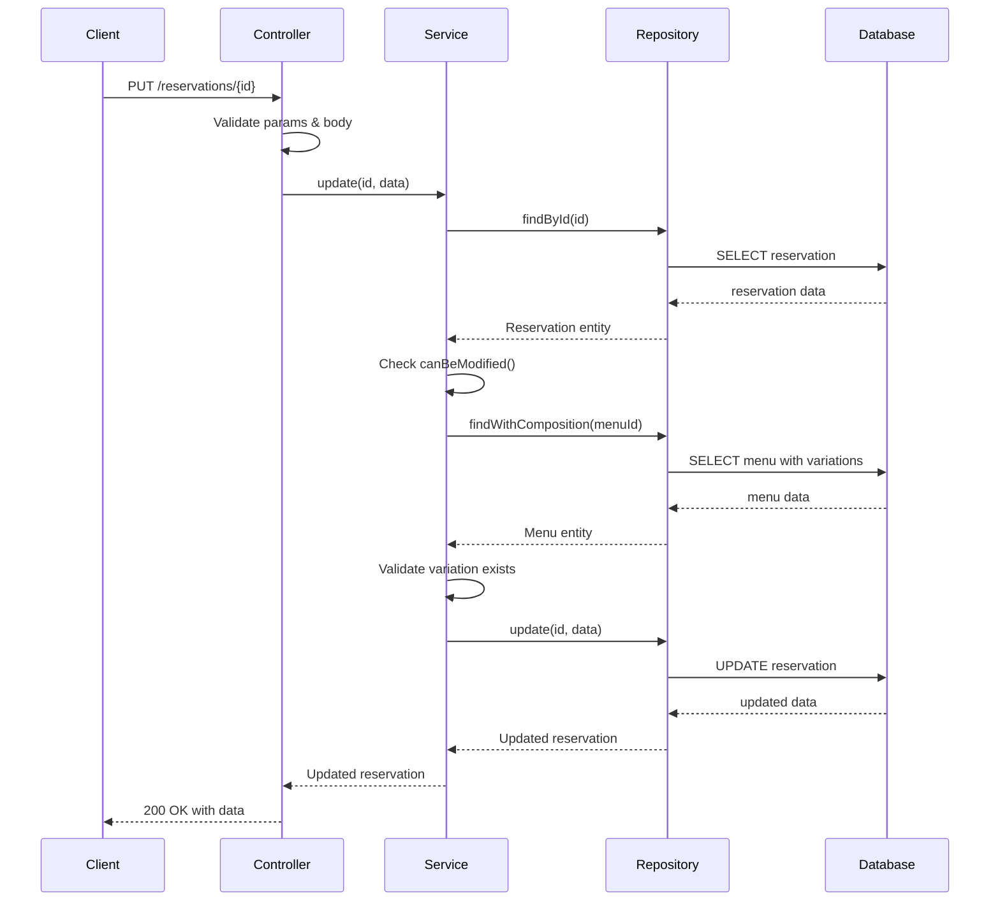

# Design Document - Fix Reservation Update Error

## Overview

Este documento descreve o design da solução para corrigir o erro 500 que ocorre ao tentar atualizar a variação do cardápio de uma reserva existente. A solução envolve investigação da causa raiz, correção do problema identificado, e melhorias no tratamento de erros e logging.

## Architecture

A arquitetura segue o padrão Hexagonal Modular já implementado no sistema:

```
HTTP Request → Controller → Service → Repository → Database
                    ↓           ↓          ↓
                Validation  Business   Data Access
                            Logic
```

### Componentes Envolvidos

1. **ReservationController.update**: Recebe a requisição HTTP, valida parâmetros e delega ao serviço
2. **ReservationService.update**: Implementa regras de negócio e validações
3. **PrismaReservationRepository.update**: Executa a atualização no banco de dados
4. **Error Handler Middleware**: Captura e formata erros para resposta HTTP

## Components and Interfaces

### 1. ReservationController

**Responsabilidades:**

- Validar parâmetros da requisição (id, body)
- Verificar autenticação e autorização
- Capturar e tratar erros específicos (ZodError, AppError)
- Retornar resposta HTTP apropriada

**Melhorias Necessárias:**

- Adicionar logging detalhado de requisições
- Melhorar tratamento de erros não capturados
- Garantir que todos os erros sejam tratados antes de chegar ao middleware global

### 2. ReservationService

**Responsabilidades:**

- Validar se a reserva existe
- Verificar se a reserva pode ser modificada (prazo, status)
- Validar se a nova variação existe e pertence ao menu correto
- Executar a atualização através do repositório

**Possíveis Causas do Erro 500:**

1. **Variação não encontrada no menu**: O método `menu.variations.find()` pode retornar undefined se a variação não existir
2. **Menu não encontrado**: Se `findWithComposition` retornar null, o código tenta acessar `menu.variations` causando erro
3. **Erro no Prisma**: Constraint violation ou erro de conexão com banco

**Melhorias Necessárias:**

- Adicionar validação explícita para menu null antes de acessar variations
- Melhorar mensagens de erro para serem mais específicas
- Adicionar logging em pontos críticos

### 3. PrismaReservationRepository

**Responsabilidades:**

- Executar query de atualização no Prisma
- Incluir relações necessárias (menu, menuVariation, user)
- Converter dados do Prisma para entidade de domínio

**Possíveis Causas do Erro 500:**

1. **Foreign Key Constraint**: menuVariationId não existe na tabela menu_variations
2. **Constraint Violation**: Tentativa de atualizar para variação que não pertence ao menu
3. **Erro de Conexão**: Problema com o banco de dados

**Melhorias Necessárias:**

- Adicionar try-catch específico para erros do Prisma
- Logar erros de constraint com detalhes
- Validar se menuVariationId existe antes de tentar atualizar

## Data Models

### UpdateReservationDTO

```typescript
interface UpdateReservationDTO {
  menuVariationId?: string
  status?: ReservationStatus
}
```

### Validation Schema (Zod)

```typescript
export const updateReservationSchema = z.object({
  menuVariationId: z
    .string()
    .uuid("ID da variação deve ser um UUID válido")
    .optional(),
  status: z.nativeEnum(ReservationStatus).optional(),
})
```

## Error Handling

### Hierarquia de Erros

1. **Validation Errors (400)**
   - Zod validation failures
   - Invalid UUID format
   - Missing required fields

2. **Business Logic Errors (400/404/409)**
   - Reservation not found (404)
   - Reservation cannot be modified (400)
   - Menu variation not found (404)
   - Cutoff time expired (400)

3. **Authorization Errors (401/403)**
   - User not authenticated (401)
   - User doesn't own reservation (403)

4. **Database Errors (500)**
   - Connection errors
   - Constraint violations
   - Unexpected Prisma errors

### Estratégia de Tratamento

```typescript
// No Controller
try {
  // Validação e lógica
} catch (error) {
  if (error instanceof ZodError) {
    return res
      .status(400)
      .json({ error: "Erro de validação", details: error.issues })
  }
  if (error instanceof AppError) {
    return res.status(error.statusCode).json({ error: error.message })
  }
  // Log do erro completo
  console.error("Erro não tratado ao atualizar reserva:", error)
  return res.status(500).json({ error: "Internal server error" })
}
```

## Testing Strategy

### 1. Testes de Investigação

- Adicionar logs temporários em pontos críticos
- Testar com diferentes cenários de dados
- Verificar logs do servidor durante requisições

### 2. Testes de Correção

- Testar atualização com variação válida
- Testar atualização com variação inválida
- Testar atualização com variação de outro menu
- Testar atualização após prazo expirado
- Testar atualização de reserva de outro usuário

### 3. Testes de Regressão

- Verificar que outras operações de reserva continuam funcionando
- Verificar que validações existentes não foram quebradas

## Implementation Plan

### Fase 1: Investigação

1. Adicionar logs detalhados no controller, service e repository
2. Reproduzir o erro com dados de teste
3. Analisar logs para identificar causa raiz

### Fase 2: Correção

1. Corrigir o problema identificado
2. Adicionar validações faltantes
3. Melhorar tratamento de erros

### Fase 3: Melhorias

1. Adicionar logs permanentes em pontos críticos
2. Melhorar mensagens de erro
3. Documentar o problema e solução

## Diagrama de Fluxo



## Possíveis Causas Identificadas

### Causa Mais Provável: Menu Variations Validation

No método `ReservationService.update`, quando `menuVariationId` é fornecido:

```typescript
if (reservationData.menuVariationId) {
  const menu = await this.menuRepository.findWithComposition(
    existingReservation.menuId
  )
  if (!menu) {
    throw new AppError("Cardápio da reserva não encontrado", 404)
  }

  const menuVariation = menu.variations.find(
    (v) => v.id === reservationData.menuVariationId
  )
  if (!menuVariation) {
    throw new AppError("Variação de cardápio não encontrada", 404)
  }
}
```

**Problema Potencial**: Se `menu.variations` for undefined ou null, o código causará erro ao tentar chamar `.find()`.

### Outras Causas Possíveis

1. **Foreign Key Constraint no Prisma**: Se o menuVariationId não existe ou não pertence ao menu correto
2. **Erro de Serialização**: Problema ao converter dados do Prisma para JSON
3. **Erro no Middleware de Autenticação**: req.user pode estar undefined em alguns casos

## Solução Proposta

1. **Adicionar validação explícita para menu.variations**
2. **Adicionar logs detalhados em pontos críticos**
3. **Melhorar tratamento de erros do Prisma**
4. **Adicionar validação de que a variação pertence ao menu correto**
