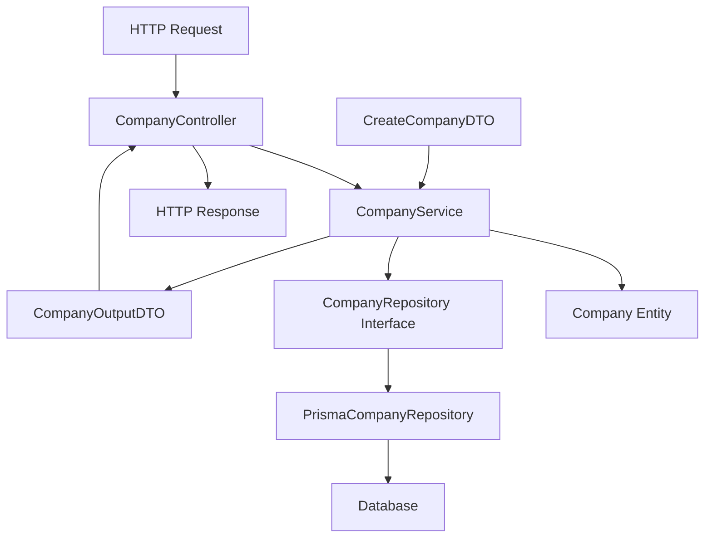
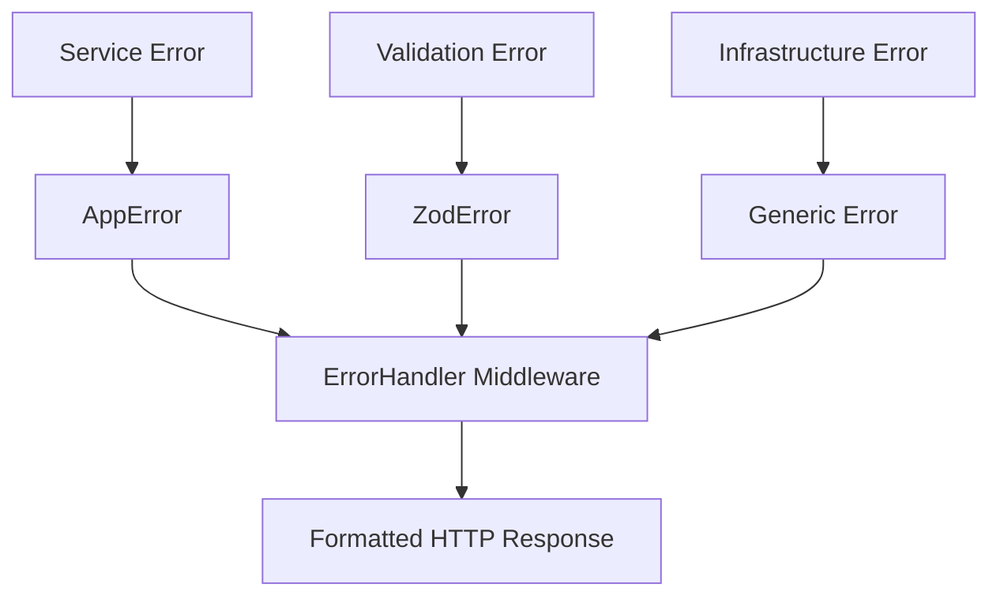

# Design Document - Reestruturação Hexagonal Modular

## Overview

Esta reestruturação visa transformar a atual arquitetura hexagonal em uma organização modular mais clara e escalável. O design mantém os princípios da arquitetura hexagonal enquanto organiza o código por módulos funcionais, facilitando a manutenção e evolução do sistema.

## Architecture

### Estrutura de Diretórios Proposta

```
src/
├── app/                          # Camada de Aplicação
│   ├── modules/                  # Módulos organizados por funcionalidade
│   │   ├── company/              # Módulo Company (exemplo existente)
│   │   │   ├── domain/           # Entidades e interfaces do domínio
│   │   │   │   ├── Company.ts    # Entidade Company
│   │   │   │   └── CompanyRepository.ts # Interface do repositório
│   │   │   ├── CompanyService.ts # Lógica de negócio/casos de uso
│   │   │   └── dtos/             # Data Transfer Objects
│   │   │       ├── CreateCompanyDTO.ts
│   │   │       ├── UpdateCompanyDTO.ts
│   │   │       └── CompanyOutputDTO.ts
│   │   └── user/                 # Exemplo de novo módulo
│   │       ├── domain/
│   │       ├── UserService.ts
│   │       └── dtos/
│   └── shared/                   # Componentes compartilhados
│       ├── errors/               # Exceções da aplicação
│       │   └── AppError.ts
│       ├── types/                # Tipos compartilhados
│       └── interfaces/           # Interfaces compartilhadas
├── infrastructure/               # Camada de Infraestrutura
│   ├── http/                     # Adaptadores primários (entrada)
│   │   ├── controllers/          # Controllers HTTP
│   │   │   ├── CompanyController.ts
│   │   │   └── UserController.ts
│   │   ├── routes/               # Definição de rotas
│   │   │   ├── company.routes.ts
│   │   │   ├── user.routes.ts
│   │   │   └── index.ts
│   │   ├── middlewares/          # Middlewares HTTP
│   │   │   └── errorHandler.ts
│   │   └── validators/           # Validadores de entrada
│   │       └── companySchemas.ts
│   ├── database/                 # Adaptadores secundários (saída)
│   │   ├── repositories/         # Implementações de repositórios
│   │   │   ├── PrismaCompanyRepository.ts
│   │   │   └── PrismaUserRepository.ts
│   │   └── prisma.ts            # Configuração do ORM
│   └── service-providers/        # Provedores de serviços externos
│       └── MailProvider.ts
├── config/                       # Configurações da aplicação
│   └── swagger.ts
└── server.ts                     # Ponto de entrada da aplicação
```

### Princípios da Arquitetura

1. **Separação por Módulos**: Cada funcionalidade (Company, User, etc.) é organizada em seu próprio módulo
2. **Independência de Camadas**: Domain não depende de Infrastructure, Application não depende de detalhes externos
3. **Inversão de Dependência**: Infrastructure implementa interfaces definidas no Domain
4. **Single Responsibility**: Cada componente tem uma responsabilidade específica

## Components and Interfaces

### Domain Layer (app/modules/\*/domain/)

**Responsabilidades:**

- Definir entidades de negócio
- Definir interfaces de repositórios (portas secundárias)
- Conter regras de negócio puras

**Exemplo - Company Domain:**

```typescript
// app/modules/company/domain/Company.ts
export class Company {
  // Entidade com regras de negócio
}

// app/modules/company/domain/CompanyRepository.ts
export interface CompanyRepository {
  // Interface que será implementada na infrastructure
}
```

### Application Layer (app/modules/\*/service/)

**Responsabilidades:**

- Implementar casos de uso
- Orquestrar operações entre entidades
- Definir DTOs de entrada e saída

**Exemplo - Company Service:**

```typescript
// app/modules/company/CompanyService.ts
export class CompanyService {
  constructor(private companyRepository: CompanyRepository) {}
  // Casos de uso implementados aqui
}
```

### Infrastructure Layer (infrastructure/)

**Responsabilidades:**

- Implementar adaptadores primários (HTTP)
- Implementar adaptadores secundários (Database, External Services)
- Configurar dependências externas

### DTOs (app/modules/\*/dtos/)

**Responsabilidades:**

- Definir contratos de entrada e saída
- Validar estrutura de dados
- Isolar camadas internas de detalhes externos

## Data Models

### Company Module Data Flow



### DTO Structure

**Input DTOs:**

- `CreateCompanyDTO`: Dados para criação
- `UpdateCompanyDTO`: Dados para atualização
- Validação de entrada usando Zod

**Output DTOs:**

- `CompanyOutputDTO`: Dados de resposta padronizados
- Controle sobre quais dados são expostos

## Error Handling

### Estratégia de Tratamento de Erros

1. **Domain Errors**: Erros de regra de negócio lançados pelos services
2. **Validation Errors**: Erros de validação de entrada (Zod)
3. **Infrastructure Errors**: Erros de banco de dados, rede, etc.

### Error Flow



### Shared Error Components

- `AppError`: Classe base para erros da aplicação
- `ErrorHandler`: Middleware centralizado para tratamento
- Status codes padronizados por tipo de erro

## Testing Strategy

### Estrutura de Testes

```
tests/
├── unit/                    # Testes unitários
│   ├── app/
│   │   └── modules/
│   │       └── company/
│   │           ├── domain/
│   │           └── CompanyService.test.ts
│   └── infrastructure/
├── integration/             # Testes de integração
│   └── repositories/
└── e2e/                    # Testes end-to-end
    └── company.e2e.test.ts
```

### Testing Approach

1. **Unit Tests**: Testar services e entities isoladamente
2. **Integration Tests**: Testar repositórios com banco real
3. **E2E Tests**: Testar fluxos completos via HTTP

### Mocking Strategy

- Mock repositories nos testes de service
- Use banco de teste para testes de integração
- Factories para criação de dados de teste

## Migration Plan

### Fase 1: Estrutura Base

1. Criar nova estrutura de diretórios
2. Mover shared components (AppError)
3. Configurar barrel exports

### Fase 2: Company Module Migration

1. Migrar Company entity para domain
2. Criar CompanyRepository interface
3. Migrar CompanyService
4. Criar DTOs específicos
5. Atualizar imports

### Fase 3: Infrastructure Reorganization

1. Reorganizar controllers
2. Reorganizar routes
3. Reorganizar repositories
4. Atualizar dependency injection

### Fase 4: Validation & Testing

1. Executar testes existentes
2. Corrigir imports quebrados
3. Validar funcionalidade
4. Atualizar documentação

## Implementation Considerations

### Dependency Injection

- Manter injeção de dependência no server.ts
- Controllers recebem services via constructor
- Services recebem repositories via constructor

### Import Management

- Usar barrel exports (index.ts) para simplificar imports
- Imports relativos dentro do módulo
- Imports absolutos entre módulos

### Backward Compatibility

- Manter APIs HTTP existentes
- Preservar comportamento atual
- Migração incremental sem breaking changes
