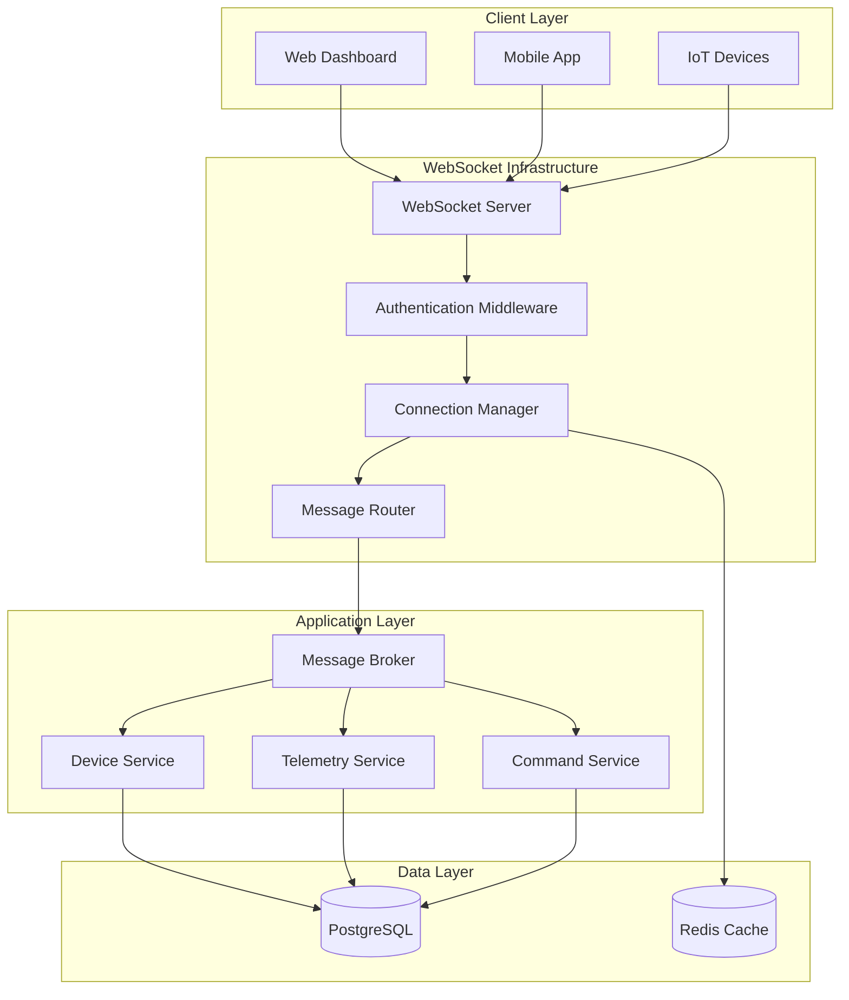
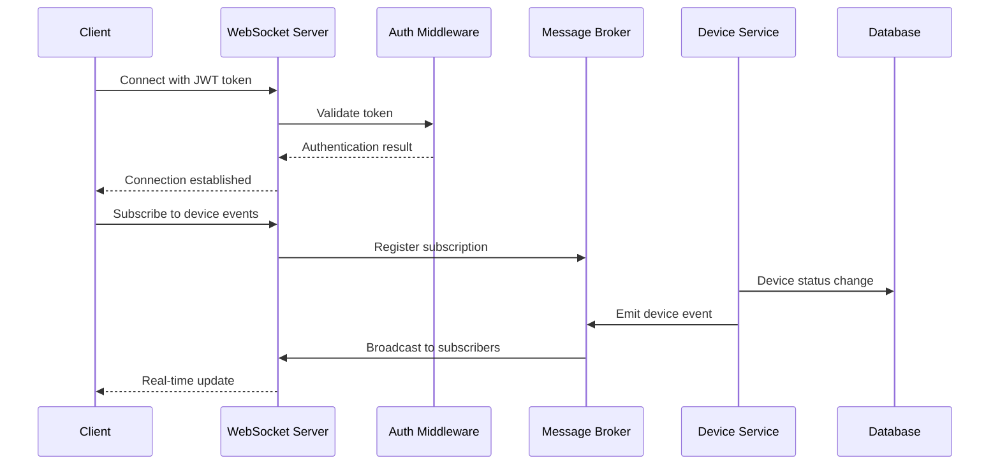

# WebSocket Implementation Design Document

## Overview

This design document outlines the comprehensive WebSocket implementation for the Device Management API. The system will provide real-time bidirectional communication between IoT devices, client applications, and the server, enabling instant device monitoring, telemetry data transmission, and remote device control.

The implementation builds upon the existing Socket.IO foundation and extends it to support authentication, device-specific communication channels, telemetry data processing, and command routing while maintaining the hexagonal architecture principles.

## Architecture

### High-Level Architecture



### WebSocket Event Flow



## Components and Interfaces

### 1. Enhanced WebSocket Server

**Location:** `src/infrastructure/websocket/`

#### WebSocketServer Interface

```typescript
interface IWebSocketServer {
  // Connection management
  handleConnection(socket: Socket): void
  handleDisconnection(socket: Socket): void

  // Authentication
  authenticateConnection(socket: Socket, token: string): Promise<boolean>

  // Event broadcasting
  broadcastToClients(event: string, data: any): void
  broadcastToDevices(event: string, data: any): void
  sendToDevice(deviceId: string, event: string, data: any): void

  // Subscription management
  subscribeToDeviceEvents(socket: Socket, deviceId?: string): void
  unsubscribeFromDeviceEvents(socket: Socket, deviceId?: string): void
}
```

#### Enhanced WebSocketService

```typescript
export class WebSocketService implements IWebSocketServer {
  private io: SocketIOServer
  private connectionManager: ConnectionManager
  private messageRouter: MessageRouter
  private authMiddleware: WebSocketAuthMiddleware

  constructor(
    httpServer: HttpServer,
    connectionManager: ConnectionManager,
    messageRouter: MessageRouter,
    authMiddleware: WebSocketAuthMiddleware
  )
}
```

### 2. Connection Manager

**Purpose:** Manages active WebSocket connections, client types, and connection metadata.

```typescript
interface ConnectionInfo {
  socketId: string
  clientType: 'device' | 'client'
  deviceId?: string
  userId?: string
  connectedAt: Date
  lastActivity: Date
}

export class ConnectionManager {
  private connections: Map<string, ConnectionInfo>
  private deviceConnections: Map<string, string> // deviceId -> socketId
  private clientSubscriptions: Map<string, Set<string>> // socketId -> Set<deviceId>

  registerConnection(socket: Socket, clientType: 'device' | 'client', metadata: any): void
  unregisterConnection(socketId: string): void
  getDeviceConnection(deviceId: string): string | undefined
  getClientSubscriptions(socketId: string): Set<string></string>subscribeToDevice(socketId: string, deviceId: string): void
  unsubscribeFromDevice(socketId: string, deviceId: string): void
  getConnectionStats(): ConnectionStats
}
```

### 3. Message Router

**Purpose:** Routes messages between different client types and handles message validation.

```typescript
export class MessageRouter {
  constructor(
    private connectionManager: ConnectionManager,
    private telemetryService: TelemetryService,
    private commandService: CommandService
  )

  routeMessage(socket: Socket, event: string, data: any): Promise<void>
  handleTelemetryData(socket: Socket, data: TelemetryData): Promise<void>
  handleDeviceCommand(socket: Socket, data: DeviceCommand): Promise<void>
  handleClientSubscription(socket: Socket, data: SubscriptionData): void
}
```

### 4. Authentication Middleware

**Purpose:** Handles JWT token validation for WebSocket connections.

```typescript
export class WebSocketAuthMiddleware {
  constructor(private jwtSecret: string)

  authenticate(socket: Socket, next: (err?: Error) => void): void
  validateToken(token: string): Promise<AuthPayload | null>
  extractTokenFromSocket(socket: Socket): string | null
}
```

### 5. Telemetry Service

**Purpose:** Processes and stores telemetry data from IoT devices.

```typescript
interface TelemetryData {
  deviceId: string
  timestamp: Date
  sensorType: string
  value: number
  unit: string
  metadata?: Record<string, any>
}

export class TelemetryService {
  constructor(
    private telemetryRepository: TelemetryRepository,
    private deviceRepository: DeviceRepository
  )

  processTelemetryData(data: TelemetryData): Promise<void>
  validateTelemetryData(data: any): TelemetryData
  storeTelemetryData(data: TelemetryData): Promise<void>
  broadcastTelemetryUpdate(data: TelemetryData): void
}
```

### 6. Command Service

**Purpose:** Handles device commands from clients and routes them to appropriate devices.

```typescript
interface DeviceCommand {
  deviceId: string
  command: string
  parameters?: Record<string, any>
  requestId: string
  timestamp: Date
}

export class CommandService {
  constructor(
    private deviceRepository: DeviceRepository,
    private connectionManager: ConnectionManager
  )

  executeCommand(command: DeviceCommand): Promise<CommandResult>
  validateCommand(data: any): DeviceCommand
  sendCommandToDevice(deviceId: string, command: DeviceCommand): Promise<void>
  handleCommandResponse(deviceId: string, response: CommandResponse): void
}
```

## Data Models

### WebSocket Event Types

```typescript
// Client -> Server Events
interface ClientEvents {
  "device:subscribe": { deviceId?: string }
  "device:unsubscribe": { deviceId?: string }
  "device:command": DeviceCommand
  "telemetry:subscribe": { deviceId: string }
}

// Device -> Server Events
interface DeviceEvents {
  "device:register": { deviceId: string; capabilities: string[] }
  "telemetry:data": TelemetryData
  "command:response": CommandResponse
  "device:heartbeat": { timestamp: Date }
}

// Server -> Client Events
interface ServerToClientEvents {
  "device:created": Device
  "device:updated": Device
  "device:deleted": { id: string }
  "device:status-changed": { id: string; status: string; updatedAt: Date }
  "device:connected": { id: string; connectedAt: Date }
  "device:disconnected": { id: string; disconnectedAt: Date }
  "telemetry:update": TelemetryData
  "command:result": CommandResult
}

// Server -> Device Events
interface ServerToDeviceEvents {
  "device:command": DeviceCommand
  "device:config-update": DeviceConfig
}
```

### Database Schema Extensions

```sql
-- Telemetry data table
CREATE TABLE telemetry_data (
  id UUID PRIMARY KEY DEFAULT gen_random_uuid(),
  device_id UUID NOT NULL REFERENCES devices(id) ON DELETE CASCADE,
  sensor_type VARCHAR(100) NOT NULL,
  value DECIMAL(15,6) NOT NULL,
  unit VARCHAR(20) NOT NULL,
  metadata JSONB,
  timestamp TIMESTAMP WITH TIME ZONE NOT NULL,
  created_at TIMESTAMP WITH TIME ZONE DEFAULT NOW()
);

-- Device commands table
CREATE TABLE device_commands (
  id UUID PRIMARY KEY DEFAULT gen_random_uuid(),
  device_id UUID NOT NULL REFERENCES devices(id) ON DELETE CASCADE,
  command VARCHAR(100) NOT NULL,
  parameters JSONB,
  status VARCHAR(20) NOT NULL DEFAULT 'pending',
  request_id VARCHAR(100) NOT NULL,
  response JSONB,
  created_at TIMESTAMP WITH TIME ZONE DEFAULT NOW(),
  executed_at TIMESTAMP WITH TIME ZONE
);

-- Connection logs table
CREATE TABLE connection_logs (
  id UUID PRIMARY KEY DEFAULT gen_random_uuid(),
  device_id UUID REFERENCES devices(id) ON DELETE CASCADE,
  socket_id VARCHAR(100) NOT NULL,
  client_type VARCHAR(20) NOT NULL,
  connected_at TIMESTAMP WITH TIME ZONE NOT NULL,
  disconnected_at TIMESTAMP WITH TIME ZONE,
  duration_seconds INTEGER
);
```

## Error Handling

### WebSocket Error Types

```typescript
export enum WebSocketErrorType {
  AUTHENTICATION_FAILED = "AUTHENTICATION_FAILED",
  INVALID_MESSAGE_FORMAT = "INVALID_MESSAGE_FORMAT",
  DEVICE_NOT_FOUND = "DEVICE_NOT_FOUND",
  COMMAND_EXECUTION_FAILED = "COMMAND_EXECUTION_FAILED",
  TELEMETRY_VALIDATION_FAILED = "TELEMETRY_VALIDATION_FAILED",
  SUBSCRIPTION_FAILED = "SUBSCRIPTION_FAILED",
  RATE_LIMIT_EXCEEDED = "RATE_LIMIT_EXCEEDED",
}

interface WebSocketError {
  type: WebSocketErrorType
  message: string
  code: number
  details?: any
}
```

### Error Handling Strategy

1. **Connection Errors:** Graceful disconnection with error codes
2. **Message Validation Errors:** Send error response to sender
3. **Authentication Errors:** Immediate disconnection
4. **Rate Limiting:** Temporary throttling with backoff
5. **Device Communication Errors:** Retry mechanism with exponential backoff

## Testing Strategy

### Unit Tests

- WebSocket service components
- Message routing logic
- Authentication middleware
- Data validation functions
- Connection management

### Integration Tests

- WebSocket server with real Socket.IO connections
- Database operations with telemetry and command data
- Authentication flow with JWT tokens
- Message broadcasting to multiple clients

### End-to-End Tests

- Complete device registration and communication flow
- Real-time telemetry data transmission
- Command execution from client to device
- Multi-client subscription and broadcasting
- Connection resilience and reconnection

### Performance Tests

- Concurrent connection handling (target: 1000+ connections)
- Message throughput (target: 100 messages/second per device)
- Memory usage under load
- Connection establishment time

## Security Considerations

### Authentication & Authorization

- JWT token validation for all connections
- Role-based access control (device vs. client permissions)
- Token expiration and refresh mechanism
- Device-specific authentication keys

### Data Protection

- Input validation for all WebSocket messages
- Rate limiting to prevent abuse
- Message size limits
- Sanitization of telemetry data and commands

### Connection Security

- CORS configuration for web clients
- SSL/TLS encryption for production
- Connection timeout management
- Heartbeat mechanism for connection health

## Performance Optimizations

### Connection Management

- Connection pooling and reuse
- Efficient data structures for connection lookup
- Memory-efficient subscription management
- Automatic cleanup of stale connections

### Message Processing

- Asynchronous message handling
- Message queuing for high-throughput scenarios
- Batch processing for telemetry data
- Compression for large messages

### Caching Strategy

- Redis for connection metadata
- In-memory caching for frequently accessed device data
- Connection state persistence for server restarts

## Monitoring and Observability

### Metrics to Track

- Active connection count by client type
- Message throughput (messages/second)
- Average message processing time
- Connection establishment/disconnection rates
- Error rates by error type
- Device heartbeat status

### Logging Strategy

- Connection events (connect/disconnect)
- Authentication attempts and failures
- Message routing and processing
- Error occurrences with context
- Performance metrics

### Health Checks

- WebSocket server health endpoint
- Connection manager status
- Message router health
- Database connectivity for telemetry storage
